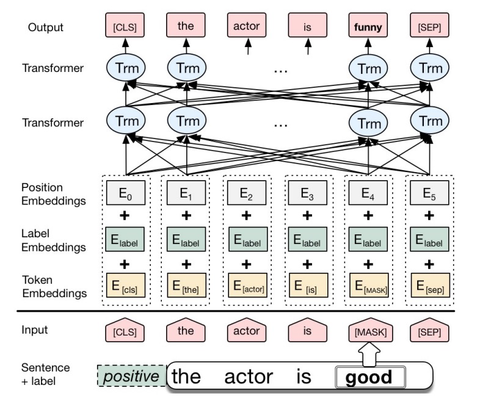

当前的模型基本求解的是数据集，而非任务，所以数据显得异常重要。
# Chinese NLP Data Augmentation
主要对中文SLU数据做数据增强，主要包括意图分类数据、槽位填充的数据。理论上分类数据也行。

# 同义词替换
应该是最早的方法， 通过对于语句中的同义词替换，保证语义不变性，根据同义词的来源，又可以分为几种方案

## WordNet

通过WrodNet中的同义词召回相近似的词语，见

```python
import nltk
from nltk.corpus import wordnet
nltk.download('omw')
word = "空调"
for each in wordnet.synsets(word, lang='cmn'):
    print(each.lemma_names('cmn'), )
# ['冷气机', '空调', '空调器', '空调装置', '空调设备']
```

全量代码见：[word_sim.py](https://github.com/InsaneLife/NLPDataAugmentation/blob/master/word_sim.py)

## synonyms

[synonyms](https://github.com/huyingxi/Synonyms)是一个中文近义词工具包，见

```python
import synonyms
word = "空调"
print(synonyms.nearby(word))
# (['空调', '冷气', '空调设备', '空调系统', '波箱', '用车', '制冷', '空调机', '空气调节', '巴士在'], [1.0, 0.75175405, 0.7452018, 0.6877022, 0.6544307, 0.62812567, 0.62259305, 0.59779996, 0.57414114, 0.5611771])
```

> 全量代码见：[word_sim.py](https://github.com/InsaneLife/NLPDataAugmentation/blob/master/word_sim.py)

## 词向量召回

> [A Lexical and Frame-Semantic Embedding Based Data Augmentation Approach2015](https://www.aclweb.org/anthology/D15-1306.pdf)

词向量召回主要通过将词语映射为低纬稠密向量，通过向量召回的方式来召回同义词。

- Context embedding方法。召回的可能和并非近义词，例如W2V主要是更具词语分布做的向量化，所以召回的可能是位置分布近似的词语，但是语义可能并不一样。所以也有人提出了
- Frame-Semantic Embeddings方法。

```python
from gensim.models.keyedvectors import KeyedVectors

word = "空调"
# 词向量召回，词向量下载： https://docs.qq.com/sheet/DVnpkTnF6VW9UeXdh?tab=BB08J2
w2v_file = "./cn_bi_fastnlp_100d.txt"
w2v_model = KeyedVectors.load_word2vec_format(w2v_file)
print(w2v_model.similar_by_word(word)[:10])
# [('冷气', 0.832690954208374), ('暖气', 0.7806607484817505), ('电扇', 0.7694630026817322), ('电热', 0.7415034174919128), ('风扇', 0.7370954751968384), ('供暖', 0.7363734841346741), ('采暖', 0.7239724397659302), ('电暖', 0.7215089797973633), ('通风', 0.7174738645553589), ('隔音', 0.7118726968765259)]
```

> 全量代码见：[word_sim.py](https://github.com/InsaneLife/NLPDataAugmentation/blob/master/word_sim.py)


## 生成方法

> 见 [bert_main.py](./bert_main.py)
看过很多奇奇怪怪的生成方法，有seq2seq([shin2019utterance](https://ieeexplore.ieee.org/abstract/document/8625384/), [kurata2016labeled](https://www.isca-speech.org/archive/Interspeech_2016/pdfs/0727.PDF), [kurata2016labeled](https://www.isca-speech.org/archive/Interspeech_2016/pdfs/0727.PDF?cm_mc_uid=92085802250714671469934&cm_mc_sid_50200000=1475548151))、VAE([yoo2020variational](https://arxiv.org/abs/2001.08604),[xie2019unsupervised](https://arxiv.org/abs/1904.12848))等方法，个人觉得和任务耦合，不太具备通用性，反倒是借助语言模型来做生成比较靠谱。

> 主要参考[Context Augmentation](https://arxiv.org/pdf/1805.06201.pdf)，通过Bi-LSTM训练语言模型，并且加入了数据label来控制生成。
>
> [Conditional BERT Contextual Augmentation](https://arxiv.org/pdf/1812.06705.pdf)，在前文基础上引入了BERT。



针对分类问题，作者将BERT原来的segment embedding换成了label embedding，然后在数据上继续使用MLM任务继续finetune, 训练好之后预测过程输入包含：

- 原始query的token，不过会做一些随机mask，来预测mask掉的词语。
- 分类的类别标签，保证语义不变性。

针对中文数据，笔者认为其实还可以做基于此可以在做一些优化。

1. mask策略可以改，可以使用分词方法，将随机mask改为词语mask。
2. 同时也可以随机插入mask，同样，插入的位置是在词语之间而非其内部。

基于此咱们就来尝试一把，对于原始输入，使用了此方法之后增强的数据：
原始句子：
```
帮我查一下航班信息
查一下航班信息
附近有什么好玩的
```

生成的句子：
```text
请帮我查一下航班信息
能帮我查一下航班信息
你帮我查一下航班信息
检查一下航班信息
调查一下航班信息
查查一下航班信息
这附近有什么好玩的
那附近有什么好玩的
家附近有什么好玩的
附近附有什么好玩的
附近最有什么好玩的
附近近有什么好玩的
```
更多生成的结果查看[./data/bert_output](./data/bert_output)

# 回译
通过将目标句子翻译为外语，然后将外语翻译成中文，翻译一般会重新组织句子结构，所以增强后的数据具备一定的句式丰富性，下面是使用了[百度翻译api](http://api.fanyi.baidu.com/api/trans/product/apidoc)的结果。

```python
if __name__ == '__main__':
    queries = '帮我查一下航班信息,查一下航班信息,附近有什么好玩的'.split(",")
    # 根据语言列表，可以翻译成多个句子, language: en,jp,kor,fra,spa,th,ara,ru,pt,de,it,el,nl,pl,bul,est,dan,fin,cs,rom,slo,swe,hu,cht,vie...
    for query in queries:
        out_arr = []
        lan_list = "en,jp,kor".split(",")
        for tmp_lan in lan_list:
            for tmp_q in baidu_translate(query, tmp_lan):
                out_arr.extend(baidu_translate(tmp_q, 'zh'))
        print(list(set(out_arr)))
    # ['帮我查一下航班信息', '请帮我查一下飞机的情报。', '帮我检查航班信息。', '检查我的航班信息。'...
    # ['打听一下航班的信息。', '检查航班', '检查VOO信息', '查看航班信息', ...
    # ['这里有什么有趣的？', '这里有什么有趣的', '这个地方有什么有趣的？', ...
```
> 完整代码见：[back_translate.py](https://github.com/InsaneLife/NLPDataAugmentation/blob/master/back_translate.py)

原始句子：
```
附近有什么好玩的
```
增强的结果：
```text
['这里有什么有趣的？', '这里有什么有趣的', '这个地方有什么有趣的？', '这里有什么好玩的？', '这里有什么好玩的', '这个地方有什么好玩的？', '发生什么事了？', '这附近有什么好玩的地方吗', '有什么有趣的？', '附近有什么好玩的吗？', '这附近有什么好玩的', '附近有什麼好玩的', '附近有什么有趣的东西吗？']
```


# EDA
> 同义词替换已有，其他三个方法，说实话，可用性不高，里面会生成很多错误的query。
> 由于随机替换、交换、删除会让原本序列化的句子的序列变得不重要，模型更关注某些词语是否出现，增加模型误识别风险。

对原[EDA](https://arxiv.org/abs/1901.11196)针对中文做了一些修改，主要是修改为中文停用词，同义词召回使用WordNet/synonyms/词向量召回。

完整中文代码见：[eda_chinese.py](./eda_chinese.py)

[eda](https://arxiv.org/abs/1901.11196)的四种方法：
- synonym replacement(SR)：随机选取句子中n个非停用词的词语。对于每个词语随机选取它的一个同义词替换该词语。
- random insertion(RI)：随机选取句子中的一个非停用词的词语，随机选取这个词语的一个近义词，将近义词随机插入到句子中，做n次。
- random swap(RS)：随机选取两个词语，交换他们的位置，做n次。
- random deletion(RD)：对于句子中的每个词语，以概率p选择删除。

[eda论文翻译](https://blog.csdn.net/shine19930820/article/details/103789604)

# 数据中提取

与其生产句子，不如从已有的语料中挖掘可能相关的数据。

[wang2015s](https://www.aclweb.org/anthology/D15-1306.pdf)从Twitter中挖掘日志，作者用聚类的方法标注出相似的数据，做一遍预标注，然后通过人工标注其中每个类簇的类别。

> 聚类方法中，聚类个数设置，聚类结果需要合并或拆分，之后结果再人工review。

这篇文章也提出了使用word2vec来召回同义词，做同义词替换。


# requirement
python3, 
> pip install -r requirement.txt
word embedding file:
https://storage.googleapis.com/bert_models/2018_11_03/chinese_L-12_H-768_A-12.zip
https://ai.tencent.com/ailab/nlp/en/data/Tencent_AILab_ChineseEmbedding.tar.gz

# reference
- https://blog.csdn.net/shine19930820/article/details/107649344
- [EDA: Easy Data Augmentation Techniques for Boosting Performance on Text Classification Tasks](https://arxiv.org/abs/1901.11196)
- https://github.com/jasonwei20/eda_nlp
- https://ai.tencent.com/ailab/nlp/en/embedding.html
- https://mp.weixin.qq.com/s/qmJdioUgqcahc_9RLn9vjw
- Conditional BERT Contextual Augmentation
